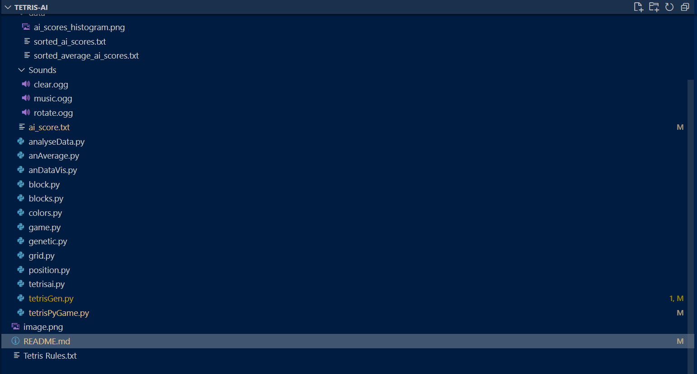

# Tetris-AI
## Inhoud

- [Doelstellingen](#doelstellingen)
- [Probleemstelling](#probleemstelling)
- [Analyse](#analyse)
- [Resultaat](#resultaat)
- [Uitbreiding](#uitbreiding)
- [Conclusie](#conclusie)
- [Bibliografie](#bibliografie)
- [License and author info](#license-and-author-info)

## Doelstelling(en)
De hoofddoelstelling van dit project is het bijleren in verband met AI algoritmen aan de hand van een project die artificiële inteligentie implementeerd. 
Wij kozen ervoor om de uitdaging aan te gaan om een AI bot te maken die zelf tetris speelt. Om dit te bereiken zijn er een aantal subdoelen die we moeten behalen om dit project tot een goed einde te brengen.

- [x] Codering basis tetris spel
- [x] Opzoeken en begrijpen wat de beste oplossing voor een tetris AI is
- [x] In grote lijnen het algoritme in kaart brengen
- [ ] Extra functionaliteit toevoegen (2/3):
    - Blok direct volledig naar beneden laten vallen met spatie (V)
    - 1V1 functionaliteit (grijze rijen bij combo's) (X)
    - Geluidseffecten (V)
- [x] Score berekenen voor bepaalde heuristieke waarden (hoogte, gaten, etc...)
- [x] Heuristiek algoritme implementeren om de beste zet te berekenen
- [x] De beste zet dan ook uitvoeren
- [x] Data verzamelen rond de beste vermenigvuldigers voor de heuristieke waarden
- [ ] Genetisch algoritme invoeren die de beste waarden zoekt/bepaald

Aan de hand van deze doelen zijn wij te werk gegaan om de tetris AI te bouwen.

## Probleemstelling
Onze doelgroep is redelijk breed, bijna iedereen heeft wel al eens tetris gespeeld en kent dus het spel. Wij willen ons vooral focussen op regelmatige spelers. 
Zo kwamen wij tijdens het occasioneel spelen van tetris vaak spelers tegen waar wij als minder ervaren spelers geen kans tegen maakten en die ons, zeker met het pvp systeem die combinatie beloond, na een korte tijd al uitschakelden. 

Daarom wilden wij de uitdaging aan gaan om een AI bot te maken die zelf tegen hen kan winnen. Deze spelers kunnen enorm snel denken, maar geen mens kan nog maar in de buurt komen van de rekenkracht die een computer heeft. Een computer heeft dus het voordeel en zou met een perfect algoritme die alle tijd van de wereld heeft nooit mogen verliezen. Dit is dan ook het probleem in een 1 tegen 1 duel, die tijd heeft de computer niet. 

Het vereist enorm veel berekeningen om elke mogelijke zet te berekenen in een spel als tetris. Er zijn zeven blokken die in een willekeurige volgorde na elkaar worden gegenereerd in een speelveld van 10 op 20 vakjes. Door deze willekeurigheid en de enorme hoeveelheid aan mogelijke oplossingen moet een alternatief worden gezocht. Het antwoord hierop vonden wij bij een heuristiek algoritme die telkens de beste oplossing zoekt voor het blok die al bekend is. 
Zo worden het aantal berekeningen al door minstens zeven gedeeld. Dit zorgt ervoor dat enkel berekeningen voor het huidige blok vereist zijn en niet voor de zes andere. 
Door ook alleen de huidige zet te berekenen en niet honderen of zelf duizenden zetten op voorhand, die toch irrelevant blijken. 
Doordat een andere blok word gegenereerd verminderd het aantal zetten drastisch.

## Analyse
We begonnen ons project door op zoek te gaan naar andere soortgelijke projecten. Veelal was de implementatie nog te moeilijk/onduidelijk voor ons of werd een andere programmeertaal gebruikt dan python. 
Wij verkozen om alles in python te programmeren en dus niet enkel het algoritme. 

Uiteindelijk vonden wij één github repository die ons eerst interessant leek, maar waar wij uiteindelijk weinig tot geen inspiratie uit haalden (zie bibliografie). Na het bekijken van veel video's in verband met dit onderwerp kwamen we wel tot een goed idee over hoe we dit best zouden aanpakken. We maakten een tetris game met de basis functionaliteit en breidden hier nog wat op uit vooraleer we begonnen aan de implementatie van ons algoritme. Na langdurig onderzoek en tot slot een andere aanpak te hebben gebruikt, werkte het algoritme (bijna naar behoren). 
We kozen een andere aanpak nadat we een lange tijd aan het debuggen en troubleshooten waren, maar nog steeds geen oplossing vonden. Na alle methodes veel korter/kleiner te maken en daarna al die methodes samen te voegen onder een grotere (parent) methode vonden wij de oplossing en werkte het project voor de eerste keer. 
We creëerden een manier om de resultaten van ons algoritme te documenteren met de gebruikte vermenigvuldigers en zorgden voor een manier om deze aan de hand van de behaalde score te ordenen. 


Op deze manier kregen wij data, maar toch duurde het nog lang. Daarom lieten wij er drie tegelijk lopen om zo nog sneller veel iteraties te doorlopen en de beste vermenigvuldigers te vinden. Uiteindelijk besloten wij zelf om naar tien velden te gaan die simultaan speelden. Dit was met het oog op het genetisch algoritme, maar het gaf ons tegelijk ook veel sneller data. 
Door de vele velden die simultaan berekeningen maken is een grote rekenkracht vereist. Een laptop op desktop volstaat, maar een nucleo of raspberry pi zou hier niet in staat toe zijn. 

Om dit project te kunnen voltooien hebben wij een aantal libraries gebruikt. 
Zo gebruikten wij pygame om makkelijk een visuele game te maken door de functionaliteit van deze library toe te passen.
Ook hebben we af en toe de random library gebruikt om een willekeurige waarde te kunnen bekomen. De sys-module in Python biedt verschillende functies en variabelen die worden gebruikt om allerlei delen van de Python-runtime-omgeving te kunnen manipuleren. 
De time library spreekt voor zich (deze hebben wij nog niet volledig geïntegreerd in ons programma). 
Tot slot gebruikten wij de OS (interactie met operatie systeem) en de copy (harde kopiëen maken van bepaalde objecten, lijsten, arrays, variablen, etc...) library. 

Door deze libraries te gebruiken konden wij bepaalde extra functionaliteit toevoegen die anders niet mogelijk zou zijn geweest. 
Zo is het visuele programma onmogelijk zonder pygame, anders werd er gewoon in de console gewerkt door het speelveld vele malen af te printen. Voor de bestanden die zorgen voor data-analyse hebben wij telkens weer de OS library gebruikt en éénmaal de matplot library om de waarden visueel voor te kunnen stellen (zoals onderstaande afbeelding in resultaat). 
Dit project werkt volledig met python, er is geen andere software vereist om dit project te doen werken. Je kan makkelijk de volledige repository kopiëeren, alle libraries installeren en dan runnen.
Ondertussen hebben we ook gezorgd voor een paar .exe bestanden, zodat het spel eenvoudig gestart kan worden.

Open de terminal binnen het project en kopiëer volgende tekst in de command line. Hierna zou het programma klaar moeten zijn om correct te werken.
```
- pip install pygame
```
```
- pip install matplotlib
```
Het programma kan ook makkelijk via een .exe file worden gebruikt.

## Resultaat
De tetris AI bestaat uit een aantal klassen die elk een aantal verschillende methodes en attributen bezitten. Sommige van deze klassen zijn enorm bondig, terwijl andere veel meer functies uitvoeren.
In het begin schommelden de waarden die de AI behaalde onder de 5000 en piekte het algoritme op 15000. Na wat testen, bijwerken en het kiezen van andere vermenigvuldigers kwamen we op volgende grafiek (die ook die eerste waarden enorm benadrukt). 
 
Ook zijn deze scores die ons algoritme behaalde niet altijd hoog, want door de willekeurige heuristieke waarden kunnen soms slechte combinaties worden gemaakt die laag scoren. 
Bijvoorbeeld wanneer de "holes vermenigvuldiger veel hoger is dan "height". Dan zal de AI liever omhoog gaan tot het spel over is dan een gat te maken. 
Met bepaalde vermenigvuldigers worden hogere scores behaald (af te leiden uit sorted_ai_scores.txt en sorted_average_scores.txt in de folder data). Door het algoritme veel te laten itereren bekwamen we veel data om zo de beste optie te kiezen. Dit is de structuur van ons project. 
 
We hebben twee main files in ons project. 
tetrisPygame.py is een speler die tegen de AI speelt, terwijl tetrisGen.py het algoritme op meerdere velden (3 of 10) laat lopen. Beide hebben een soortgelijke werking. Daarna volgt de belangrijkste klasse voor ons project, "game.py". Hierin wordt alle functionaliteit gedeclareerd en worden functies gebundeld om het spel te spelen en bepaalde AI methoden toegevoegd (zonder deze methoden zou ons algoritme niet werken). 
Hier kan je alle bewegingen vinden, controle voor blokken (binnen het veld, niet in een andere blok), het huidige en volgende blok en een methode om het veld te tekenen. 

Daarna hebben we een klasse "grid.py" die alle functionaliteit van het speelveld bevat. Er bevinden zich parameters voor de hoogte, breedte in blokken en in pixels. Hier bevinden zich veel simpele methodes die gebruikt worden in de game klasse. 
Vervolgens hebben we een file "block.py". Deze klasse bevat alle functionaliteit omtrent enkele blokken. In combinatie met "blocks.py", waar de blokken gedeclareerd worden, krijgen de blokken vorm, een rotatie status en een id. Voor het spel zelf zijn er nog twee zeer simpele klassen. "Colors.py" bevat natuurlijk alle kleuren die we gebruiken en "position.py" bevat enkel een attribuut voor de rij en de kolom. Tot slot hebben we de "tetrisai.py" file die alle functionaliteit bevat voor ons AI algoritme. Er wordt aan de hand van een aantal methodes een score gegeven aan elke zet voor het huidige blok en deze wordt dan ook toegepast.
  
     `def evaluate_board(self, board):
        height_penalty = self.calculate_height_penalty(board)
        lines_cleared_bonus = self.calculate_lines_cleared_bonus(self.tetris)
        holes_penalty = self.calculate_holes_penalty(board)
        bumpiness_penalty = self.calculate_bumpiness_penalty(board)

        height_score = height_penalty * self.height_multiplier
        lines_score = lines_cleared_bonus * self.lines_cleared_multiplier
        holes_score = holes_penalty * self.holes_multiplier
        bumpiness_score = bumpiness_penalty * self.bumpiness_multiplier

        total_score = height_score + lines_score + holes_score + bumpiness_score

        return total_score `

 In deze klasse worden de vermenigvuldigers ook gemuteerd. Voor het spel zelf hebben we nog een file "genetic.py", maar deze gebruiken we voorlopig niet. Tot slot hebben we nog drie files voor data analyse. Wanneer je het programma laat lopen wordt een file gemaakt/geüpdatet in de folder data. Hier vinden we de gesorteerde scores (met hun vermenigvuldigers), de gemiddelde score per vermenigvuldigers en een visuele weergave van de scores.

## Uitbreiding
We beslisten al snel om enkel te werken met het huidige blok. Uit de vele video's die wij bekeken was de conclusie dat het een grotere uitdaging is om het op deze manier te doen. 
Natuurlijk zal het algoritme een hogere score halen met kennis van het volgende blok, dit zou een uitbreiding zijn die we zouden toepassen met meer tijd om aan het project te werken. 
Voorlopig hebben we dit overgeslaan. 

In ons heuristiek algoritme voor het huidige blok hadden wij problemen met de berekening van de "bumpiness" en de hoeveelheid lijnen die een zet kan verwijderen. 
Het berekenen van de aantal verwijderde rijen lukte om correct op te lossen. De zogenaamde "bumpiness" geeft niet altijd de correcte waarde terug, door een verkeerde codering. De oplossing vonden wij niet en we besloten toch de huidige methode te gebruiken omdat er toch wel ergens een lijn in de berekening zit. 

We startten wel telkens met een lage waarde voor de vermenigvuldiger voor deze parameter. Op deze manier heeft hij minder invloed op de berekening die vooral onderdanig is aan de verandering in de "holes" en "height" vermenigvuldiger. De verhouding tussen deze twee is het belangrijkst. 
We hebben ook geexperimenteerd met de grijze blok functionaliteit uit de 1 tegen 1 mode van tetris, maar hier kwam ook geen doorbraak in. Dit zou zeker een meerwaarde zijn geweest voor de demo.

## Conclusie
De hoofddoelstelling die wij verwoordden in het begin van de readme werd zeker behaald. We leerden veel bij over hoe AI algoritmen werken, de moeilijkheid, de sterkte ervan en hoe je ze kan toepassen. Dit project focuste vooral op heuristieke algoritmen waar we veel over bijleerden, maar we konden ook proeven van genetische algoritmen. 

Ook zijn we er in geslaagd een oplossing te vinden op onze probleemstelling. Wanneer er met de 1 tegen 1 functionaliteit wordt gewerkt (grijze blokken naar tegenstander bij combo's) zal ons algoritme met goede parameters telkens winnen. Bij sommige iteraties bekwamen we zelf scores (binnen 2 minuten) waar een persoon een lange tijd voor moet spelen. Toch blijven er nog veel opties over om het algoritme te optimaliseren en is onze implementatie nog lang niet perfect.

De basisdoelen zijn allemaal behaald zoals ook af te leiden uit de lijst in de doelstellingen en een basis implementatie is succesvol gerealiseerd. We leerden hier ook dat het soms een voordeel kan leveren door eens helemaal opnieuw te beginnen voor een bepaald onderdeel, in plaats van uren te zoeken naar een bepaalde oplossing die mogelijk niet gevonden wordt. Hadden we dit niet gedaan, zouden we zeker niet zo ver staan als we nu doen.

## Bibliografie
- Tetris github: https://github.com/danielchang2002/tetris_ai.git
- Tutorial basis tetris spel: https://www.youtube.com/watch?v=nF_crEtmpBo
- AI bot guide (no code): https://codemyroad.wordpress.com/2013/04/14/tetris-ai-the-near-perfect-player/

- TETRIS AI Github (ons project): https://github.com/estebandesmedt/Tetris-AI

## License and author info
Made by Colin Bossuyt and Esteban Desmedt for Vives Xaveriaenenstraat, in semester 1 fase 2 voor het vak AI programming (keuzetraject Software Engineer & AI).
