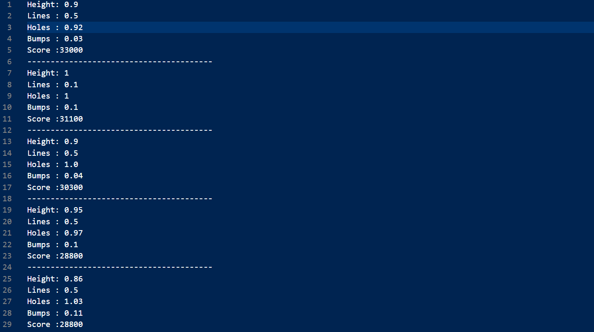
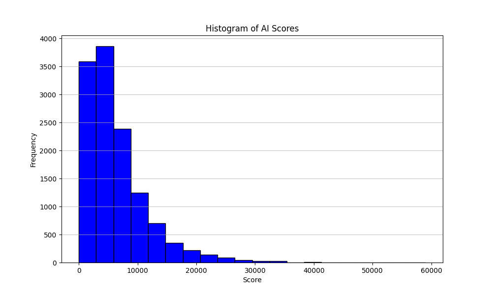

# Tetris-AI
## Doelstelling(en)
De hoofddoelstelling van dit project is het bijleren in verband met AI algoritmen aan de hand van een project die artificiële inteligentie implementeerd. Wij kozen ervoor om de uitdaging aan te gaan om een AI bot te maken die zelf tetris speelt. Om dit te bereiken zijn er een aantal subdoelen die we moeten behalen om dit project tot een goed einde te brengen.

- [x] Codering basis tetris spel
- [x] Opzoeken en begrijpen wat de beste oplossing voor een tetris AI is
- [x] In grote lijnen het algoritme in kaart brengen
- [ ] Extra functionaliteit toevoegen:
    - Blok direct volledig naar beneden laten vallen met spatie
    - 1V1 functionaliteit (grijze rijen bij combo's)
    - Geluidseffecten
- [x] Score berekenen voor bepaalde heuristieke waarden (hoogte, gaten, etc...)
- [x] Heuristiek algoritme implementeren om de beste zet te berekenen
- [x] De beste zet dan ook uitvoeren
- [x] Data verzamelen rond de beste vermenigvuldigers voor de heuristieke waarden
- [ ] Genetisch algoritme invoeren die de beste waarden zoekt/bepaald

Aan de hand van deze doelen zijn wij te werk gegaan om de tetris AI te bouwen.

## Probleemstelling
Onze doelgroep is redelijk breed, bijna iedereen heeft wel al eens tetris gespeeld en kent dus het spel. Wij willen ons vooral focussen op regelmatige spelers. Zo kwamen wij tijdens het occasioneel spelen van tetris vaak spelers tegen waar wij als minder ervaren spelers geen kans tegen maakten en die ons, zeker met het pvp systeem die combinatie beloond, na een korte tijd al uitschakelden. Daarom wilden wij de uitdaging aan gaan om een AI bot te maken die zelf tegen deze spelers kan winnen. Deze spelers kunnen enorm snel denken, maar geen mens kan nog maar in de buurt komen van de rekenkracht die een computer heeft. Een computer heeft dus het voordeel en zou met een perfect algoritme die alle tijd van de wereld heeft nooit mogen verliezen. Dit is dan ook het probleem in een 1 tegen 1 duel, die tijd heeft de computer niet. Het vereist enorm veel berekeningen om elke mogelijke zet te berekenen in een spel als tetris. Er zijn zeven blokken die in een willekeurige volgorde na elkaar worden gegenereerd in een speelveld van 10 op 20 vakjes. Door deze willekeurigheid en de enorme hoeveelheid aan mogelijke oplossingen moet een andere oplossing worden gezocht. Deze oplossing vonden wij bij een heuristiek algoritme die telkens de beste oplossing zoekt voor het blok die al bekend is. Zo worden het aantal berekeningen al minstens door zeven gedeeld. Dit doordat enkel de berekeningen voor het huidige blok vereist zijn en niet voor de zes andere. Door ook enkel de huidige zet te berekenen en niet honderen of zelf duizenden zetten op voorhand te berekenen die toch irrelevant blijken doordat een ander blok werd gegenereerd verminderd het aantal zetten drastisch.

## Analyse
Ons project begonnen wij door op zoek te gaan naar soortgelijke projecten, veelal was de implementatie nog te moeilijk voor ons of werd een andere programmeertaal gebruikt. Wij verkozen om alles in python te programmeren en dus niet enkel het algoritme. Uiteindelijk vonden wij één github repository die ons eerst interessant leek, maar waar wij uiteindelijk weinig tot geen inspiratie uit haalden (zie bibliografie). Na het bekijken van veel video's in verband met dit onderwerp kwamen we wel tot een idee over hoe we dit best zouden aanpakken. We maakten een tetris game met basis functionaliteit en breidden hier nog wat op uit vooraleer we begonnen aan ons algoritme. Na heel lang zoeken en uiteindelijk een andere aanpak te gebruiken werkte het algoritme (bijna naar behoren). We creëerden een manier om de resultaten van ons algoritme te documenteren met de gebruikte vermenigvuldigers en zorgden voor een manier om deze aan de hand van de behaalde score te ordenen. 
Op deze manier kregen wij data, het ging snel, maar duurde toch nog lang. Daarom lieten wij er drie tegelijk lopen om zo nog sneller veel iteraties te doorlopen en zo nog sneller de beste vermenigvuldigers te vinden. Uiteindelijk besloten wij zelf om naar tien velden te gaan die simultaan speelden. Dit was met het oog op het genetisch algoritme, maar gaf ons tegelijk ook veel sneller data. Door de vele velden die tegelijk berekeningen maken is een grote rekenkracht vereist. Een laptop op desktop volstaat, maar een nucleo of raspberry pi zou hier niet in staat toe zijn. Om dit project te kunnen voltooien hebben wij een aantal libraries gebruikt. Zo gebruikten wij pygame om makkelijk een visuele game te maken door de functionaliteit van deze library toe te passen. Ook hebben we af en toe de random library gebruikt om een willekeurige waarde te kunnen bekomen. De sys-module in Python biedt verschillende functies en variabelen die worden gebruikt om verschillende delen van de Python-runtime-omgeving te kunnen manipuleren. De time library spreekt voor zich (deze hebben wij nog niet volledig geïntegreerd in ons programma). Tot slot gebruikten wij de OS (interactie met operatie systeem) en de copy (harde kopiëen maken van bepaalde objecten, lijsten, arrays, variablen, etc...) library. Door deze libraries te gebruiken konden wij bepaalde extra functionaliteit toevoegen die anders onmogelijk zou blijken. Zo is het visuele programma onmogelijk zonder pygame, anders werd er gewoon in de console gewerkt door het speelveld vele malen af te printen. Voor de bestanden die zorgen voor data-analyse hebben wij telkens weer de OS library gebruikt en éénmaal de matplot library om de waarden visueel voor te kunnen stellen (zoals onderstaande afbeelding in resultaat). Dit project werkt volledig met python, er is geen andere software vereist om dit project te doen werken. Je kan makkelijk de volledige repository kopiëeren, alle libraries installeren en dan runnen.

```
- pip install pygame
```

!!!Nog af te werken (408/500 woorden)

## Resultaat
De tetris AI bestaat uit een aantal klassen die elk verschillende methodes en attributen bezitten. Sommige van deze klassen zijn bondig, terwijl andere veel functies vervullen.
In het begin schommelden de waarden onder de 5000 en piekte het algorritme op 15000. Na wat testen, bijwerken en andere vermenigvuldigers kwamen we op volgende grafiek (die ook die eerste waarden enorm benadrukt).  Ook zijn deze scores niet altijd hoog, want door de willekeurige heuristieke waarden kunnen soms slechte combinaties worden gemaakt die laag scoren. Met bepaalde vermenigvuldigers worden hogere scores behaald (af te leiden uit sorted_ai_scores.txt en sorted_average_scores.txt in de folder data). Door het algoritme veel te laten itereren bekwamen we veel data om zo de beste optie te kiezen. 
!!!Nog af te werken (120/500 woorden)

## Uitbreiding
!!!Nog af te werken (0/200 woorden)
- Next_block knowledge
- Correcte bumpiness and lines cleared score

## Conclusie
De hoofddoelstelling die wij verwoordden in het begon van de readme werd zeker behaald. We leerden veel bij over hoe AI algoritmen werken, de moeilijkheid, de sterkte ervan en hoe je ze kan toepassen. Dit project focuste vooral op heuristieke algorritmen waar we veel over bijleerden, maar we konden ook proeven van genetische algoritmen.
!!!Nog af te werken (0/200 woorden)

## Bibliografie
- Tetris github: https://github.com/danielchang2002/tetris_ai.git
- Tutorial basis tetris spel: https://www.youtube.com/watch?v=nF_crEtmpBo
- AI bot guide (no code): https://codemyroad.wordpress.com/2013/04/14/tetris-ai-the-near-perfect-player/

- TETRIS AI Github (ons project): https://github.com/estebandesmedt/Tetris-AI
